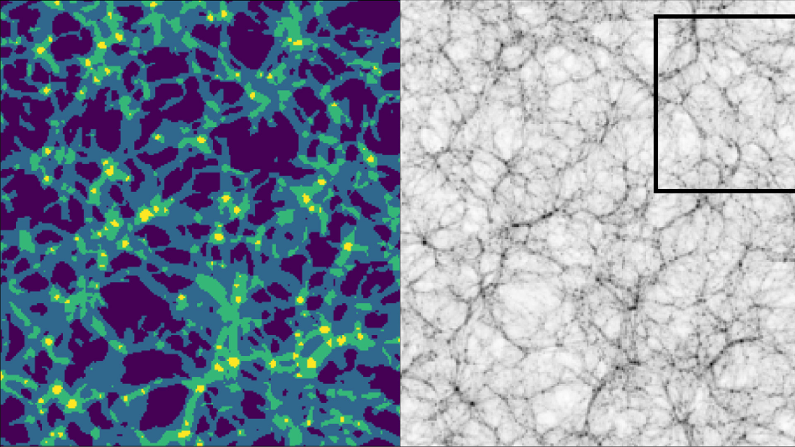

### Background
This is a project I completed during my time as a post-doctoral researcher in astrophysics. It's a Python package for identifying cosmic filaments. But aside from the method, this was a great project to get familiar with more complex Python packaging, testing and continuous integration. You can find the code [here](https://github.com/SimonPfeifer/cows) and the associated paper [here](https://arxiv.org/abs/2201.04624).

To understand the method, I need to give some context of the original problem first. Cosmic filaments are part of the cosmic web, the web-like structure of galaxies in the Universe when observed on the largest of scales(see the cover image). The aim was to develop a method to identify individual cosmic filaments, long strand-like structures, from cosmic web detection algorithms. The cosmic web detection algorithms of interest to us are called Hessian based methods. What's important here is that these discretise the cosmic web onto a *regular grid* and assign each cell (technically a voxel) one of the four primary cosmic web types; knots, filaments, sheets or voids. Knots make up the densest parts of the Universe were clusters of galaxies form (the brightest spots on the cover image), filaments are less dense, cylindrical structures connecting the knots, sheets are 2D planar-like structures with even lower density that are difficult to identify in a 2D projection, and voids are the empties regions in the Universe (dark patches in the cover image).

The cover image shows the matter, specifically dark matter, in a cosmological simulation that aims to reproduce the structures in our "local" Universe. The Milkyway, our own galaxy, would sit roughly on the intersection between a vertical line down from the "V" in Virgo and a horizontal line to the right of the top of the "A" in GA (which stands for Great Attractor).

The issue with the cosmic web detection algorithms is that it gives us one set of cells that are labelled filaments, and these are entirely interconnected and extend throughout the entire volume. The problem to solve then becomes how to divide and separate, as well as parameterise, a single filament from this collection of filament cells.

### Method
First, let's look at the problem at hand, the input data, to get a feel for what we're dealing with. The image below shows a thin slice, a single cell thick, of the cosmic web detection algorithm output. Each colour denotes a different cosmic web type as given in the caption. The lower central region of the left panel shows very nicely what we are dealing with; a set of knots (yellow) connected by a complex network of filaments (green). The filaments connect also to further knots outside of the thin slice creating a very inter-connected, tangled structure. What we would like to say is, e.g. this knot (yellow blob) is connecting to X number of filaments, or this is where this particular filament starts and ends. So we would like to segment this giant connected structure of filament cells into individual filaments which have a well defined location and exactly 2 well defined end points.


<figcaption> The identified cosmic web (left) with knots (yellow), filaments (green), sheets (blue) and voids (purple), and the corresponding density (right) where darker means more dense.</figcaption>

The method presented here, `COWS`, achieves this by applying a topological thinning algorithm called _medial axis thinning_ presented in [Lee, et al. (1994)](https://www.sciencedirect.com/science/article/abs/pii/S104996528471042X?via%3Dihub). In a nutshell, this algorithm takes a structure of cells and removes the outermost layers iteratively (the *thinning* part), following a set of rules that preserve topological properties, until only a central line (the *medial axis* part) remains. These types of algorithms are also called skeletonisation algorithms because they result in a structure that kind of looks like a plausible skeleton. Below is an example of this algorithm applied to the silhouette of a cow.

<div class="flex justify-center">

</div>
<figcaption> The medial axis thinning (or skeletonisation) applied to the silhouette of a cow. Notice that the topological properties, such as the number of holes (the one by the tail) and the connectivity (nothing is separated that was connected before, or vice versa), are preserved.</figcaption>

This method can only be applied on binary data; foreground cells that make up our shape and background cells which are empty. To apply this to our cosmic web data, we need to turn it into binary data comprised of only foreground and background cells rather than the 4 cosmic web types we have right now. That's easily done! However, one small caveat is that we don't just want to take the filament cells but also the cells that make up the knot. This is because we want the filament to connect through the knots. Without the knots we would have these strange holes in our data set. And remember, the medial axis thinning preserved holes and would create loops around the knots if they were excluded. So we take the filament and knot cells and set them to 1, and set all other cells to 0.

Now, if you have a look at the [Lee, et al. (1994)](https://www.sciencedirect.com/science/article/abs/pii/S104996528471042X?via%3Dihub) paper you'll notice that it's not the most straight forward method. There is a lot of maths that I'm really not familiar with. It took me weeks to wrap my head around the implementation (not the proofs, I'll probably never understand those) and I finally ended up with a working implementation in Python. However, it was quite slow and so I rewrote it in C. After all of that I found that there was already a great Python/[Cython](https://cython.org/) implementation in [scikit-image](https://scikit-image.org/) (I should have definitely checked first before writing my own although now I really know how it works) and it was significantly faster than my own implementation. I did have to tweak a few things, e.g. implement a periodic boundary version, for it to work with my data but that was straight forward after implementing it myself twice already.

Ok, let's actually apply this to our binary (filaments and knots) comic web data, below is the result. First of all, it's clear that that we have not achieved our goal; the complicated inter-connected structure of filaments is still present. And this is expected since the medial axis thinning conserves topological properties. However, we have greatly reduced the complexity of the problem. Instead of dealing with some arbitrary mass of cells, we now have a well defined structure made of lines that are one cell thick and connect at well defined location. We'll call the location where multiple lines meet *junctions*. However, we can also notice that there are artifacts in the output. These are large, hollow blobs which is where a few background cells have created a cavity in the input data. These cavities are preserved by the thinning and are undesirable.

<div class="flex justify-center">

</div>
<figcaption> The medial axis thinning applied to the cosmic web data. The output in red is shown on top of the density. The network is still very connected and there are undesirable "blob" (e.g. see bottom right).</figcaption>

So how do we separate this entangled mess of filaments? And what about these blobs? The good news is that both of these can be fixed with the same approach. We can find the number of neighbours for a given foreground cell within it's 3x3x3 neighbourhood. If it only has 2 neighbhours, it's part of a filament line. If it has more than 2, but less than 7 neighbours, it's a junction. Junctions can have at most 6 direct connections along its main axes (left, right, up, down, front and back) based on the medial axis thinning rules. If it has more than 6 neighbours then it is definitely part of one of the undesirable blobs. Now we simply remove all cells that have more than 2 neighbours and *voila*, the blobs are gone and we're left with individual filaments. These filaments have a well defines locations along what is often termed the spine of the filament, and well defined end points. 

<div class="flex justify-center">

</div>
<figcaption> The final filaments after applying the medial axis thinning and removal of junctions and "blobs".</figcaption>

Finally, we can also aggregate these filaments into a catalogue that defines their end points, their length, and the cells that make up each filament, including the axis along which the filament is pointing at each cell location. To define a filament, we simply look at the number of neighbours again; a single neighbour means we have an end point and 2 neighbours are the connecting cells. We can then trace each filament from end point to end point to get its properties.

And that's it! We can now use the filament catalogue to study the length distribution of filaments, or how many filaments connect to a galaxy cluster (called the *connectivity* of a cluster), or the distribution of galaxies along the spine, or in a radial direction away from the spine, or many, many other things.

<div class="flex justify-center">

</div>
<figcaption> COWS applied to higher resolution data to see the results more clearly. Some of the filaments look short or still connected because of projection effects. This is a slice in 3D projected into 2D. </figcaption>


### Usage
##### Quick installation
The easiest way to install the `cows` Python package is by using PyPI:
```
pip install pycows
```

If you prefer to install the package from source:
```
python setup.py install
```

For more information on installation, see [INSTALL.rst](https://github.com/SimonPfeifer/cows/blob/master/INSTALLATION.rst).

##### Documentation
The full documentation can be found at [here](https://python-cows.readthedocs.io/en/latest/index.html) or generated as a set of local files by running:
```
sphinx-build ./docs ./docs/_build
```

### Development
`cows` includes tests and continuous integration. Since the implementation uses modified versions of scikit-image functions, which already include tests, I adopted and extended them for `cows`. They can be found in the `cows/test` directory. To automatically run the testing pipeline and check the code base against a range of Python version, `cows` uses continuous integration in the form of [GitHub actions](https://docs.github.com/en/actions/writing-workflows). This functionality is contained within the `cows/ci` directory. The tests are automatically run with [tox](https://tox.wiki/en/latest/).

In addition, `cows` also builds and checks the documentation as part of the continuous integration. The documentation is build via [Sphinx](https://www.sphinx-doc.org/en/master/) and hosted on [readthedocs](https://about.readthedocs.com/).
 
This project was a great way to get to grips with these concepts. In principle, documentation, testing and continuous integration are straight forward but it takes some time to get familiar with the tools and setup the pipelines.

### Publications
1) [Pfeifer, S., Libeskind, N. I., Hoffman, Y., et al. 2022, MNRAS, 514, 470](https://arxiv.org/abs/2201.04624)
2) [Lee T., Kashyap R., Chu C., 1994, CVGIP: Graphical Models and Image Processing, 56, 462](https://www.sciencedirect.com/science/article/abs/pii/S104996528471042X?via%3Dihub)